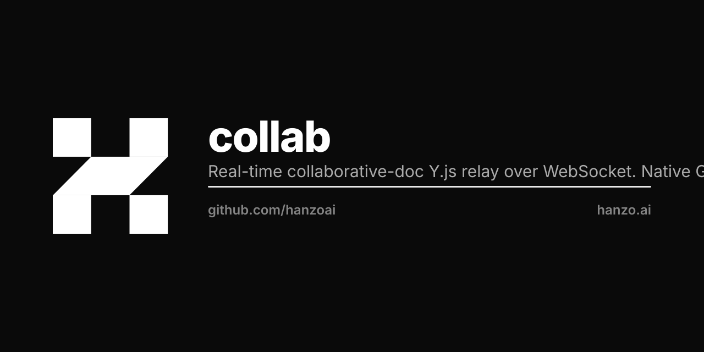

<p align="center"></p>

# collab

Hanzo realtime collaboration relay. Replaces Huly's `collaborator`
Node service with a single static Go binary.

```
clients (Y.js) ──WS──> collab ──Append──> Store (sqlite | s3)
                  └─ fan-out to peers in the same room
```

## API

| Method | Path                  | Notes |
|--------|-----------------------|-------|
| GET    | `/v1/health`          | `{"status":"ok","version":"..."}` |
| WS     | `/v1/collab/<doc_id>` | Subprotocol `yjs`. Binary frames relayed + persisted. |
| GET    | `/v1/metrics`         | Prometheus exposition. |

`doc_id` MUST be `<orgID>:<workspaceID>:<docID>`. The IAM JWT's
`owner` claim must equal `<orgID>` or the upgrade is rejected with 403.

### Auth

Bearer JWT in `Authorization: Bearer <token>` OR `?token=<token>`
(browsers cannot set headers on the WS handshake — secure ONLY over
TLS). Tokens are verified against the IAM JWKS at `IAM_JWKS_URL`
(default `https://hanzo.id/.well-known/jwks`).

## Sync protocol

The server is a dumb relay — it does NOT parse Y.js update payloads.
Justification: y-websocket clients converge via the standard Y.js sync
and awareness protocols; concatenated CRDT updates remain a valid
merged document state, so persistence is just append-only bytes. We
revisit this only when cross-region merge or server-side validation is
required.

On peer join the server immediately writes the loaded persisted state
as one binary frame so the new client can replay history before
processing live updates.

## Run

```
go run ./cmd/collab                # COLLAB_STORAGE=sqlite (default)
COLLAB_STORAGE=s3 \
  S3_ENDPOINT=https://nyc3.digitaloceanspaces.com \
  S3_REGION=nyc3 \
  S3_BUCKET=hanzo-collab \
  S3_ACCESS_KEY=... S3_SECRET_KEY=... \
  go run ./cmd/collab
```

| Env                  | Default                                  |
|----------------------|------------------------------------------|
| `COLLAB_ADDR`        | `:3078` (Huly drop-in port)              |
| `COLLAB_STORAGE`     | `sqlite`                                 |
| `COLLAB_SQLITE_PATH` | `collab.db`                              |
| `IAM_JWKS_URL`       | `https://hanzo.id/.well-known/jwks`      |
| `S3_ENDPOINT`        | (AWS default if unset)                   |
| `S3_REGION`          | `us-east-1`                              |
| `S3_BUCKET`          | required when `COLLAB_STORAGE=s3`        |
| `S3_ACCESS_KEY`      | required when `COLLAB_STORAGE=s3`        |
| `S3_SECRET_KEY`      | required when `COLLAB_STORAGE=s3`        |

## Build

```
go build ./...
go test  ./...
```

Docker (CI/CD only — never build on a laptop, see hanzoai/.github):

```
docker build --build-arg VERSION=v0.1.0 -t ghcr.io/hanzoai/collab:v0.1.0 .
```

## Deploy

Image: `ghcr.io/hanzoai/collab:<semver>`. Pin a `vX.Y.Z` or
`sha-<sha7>` tag — never `:latest`, `:main`, `:dev`.

Port 3078 is exposed (matches Huly's legacy `collaborator` port for
drop-in WS path replacement).

K8s manifest lives in `universe/infra/k8s/collab/`. Storage in prod is
S3 (DO Spaces). Local/dev is SQLite at `collab.db`.

## Layout

```
.
├── cmd/collab/main.go        # boot + signal + env
├── pkg/auth/                 # IAM JWKS verifier
├── pkg/server/               # HTTP + WS handlers
├── pkg/room/                 # in-memory broadcast registry
├── pkg/store/                # Store interface + sqlite + s3
└── pkg/metrics/              # Prometheus registry
```
